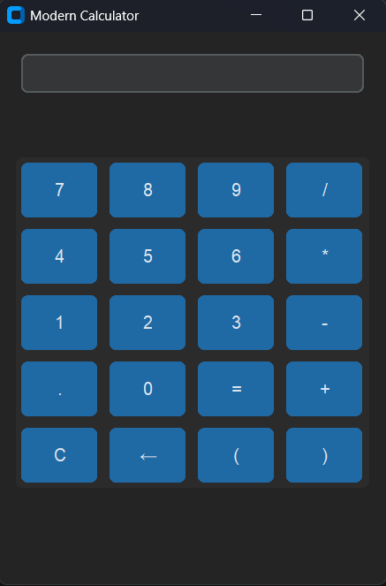

# Modern Python Calculator

This is a modern and user-friendly calculator application built with `customtkinter`. Unlike traditional calculators, this version supports both keyboard and mouse input, displays recent calculation history, supports decimal numbers, and features a dark mode interface.

## Features

- Modern and clean UI using `customtkinter`
- Mouse and keyboard input support
- Decimal (float) number calculations
- Display of recent calculation history
- Backspace functionality
- Error handling for invalid expressions
- Dark theme (can be switched to light theme if desired)

## Screenshot



## Installation

1. Clone the repository:
   ```bash
   git clone https://github.com/Selinoztrk/Calculator.git
   cd Calculator
   ```

2. Install dependencies:
   ```bash
   pip install customtkinter
   ```

## Usage

To run the application:

```bash
python calculator.py
```

## File Structure

```
calculator.py        # Main application file
README.md            # Project description
```

## Future Improvements

- Theme switcher (light/dark toggle)
- Button click sounds
- Scientific mode (trigonometric functions, etc.)
- Customizable keyboard shortcuts
